# Deep Learning Small Project 

By: Chan Luo Qi (1002983), Seow Xu Liang (1003324)

## 1. Dataset 
### 1.1 Dataset Exploration 

#### 1.1.1 Data distribution 

| | Normal | Infected (Non-Covid) | Infected (Covid)|Total|
|:---:|:---:|:---:|:---:|:---:|
|**Train**|1341|2530|1345|5216|
|**Test**|234|242|138|614|
|**Validation**|8|8|8|24|
|**Total**|1583|2780|1491|5854|

|Overall distribution|Normal vs Infected|Infected Distribution|
|:---:|:---:|:---:|
|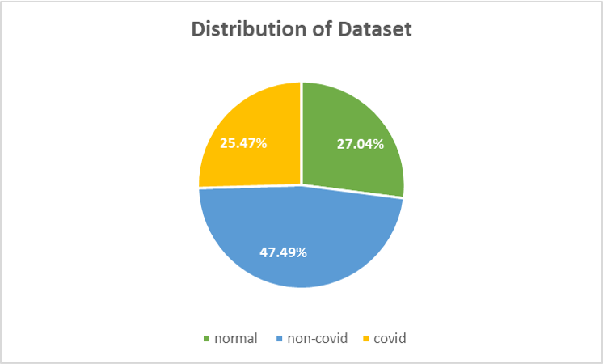|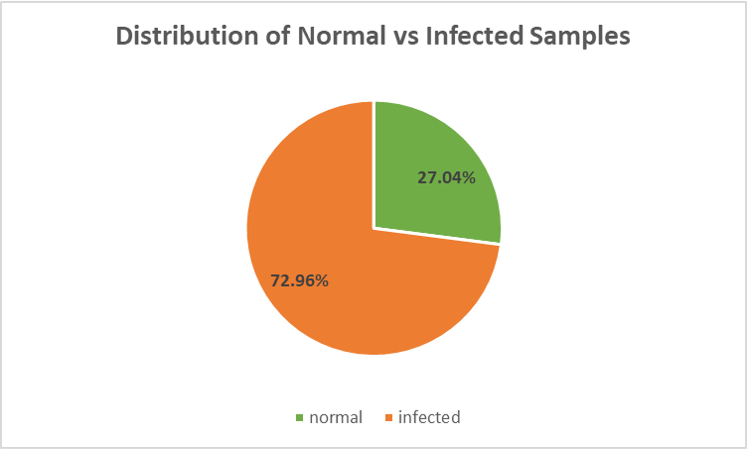|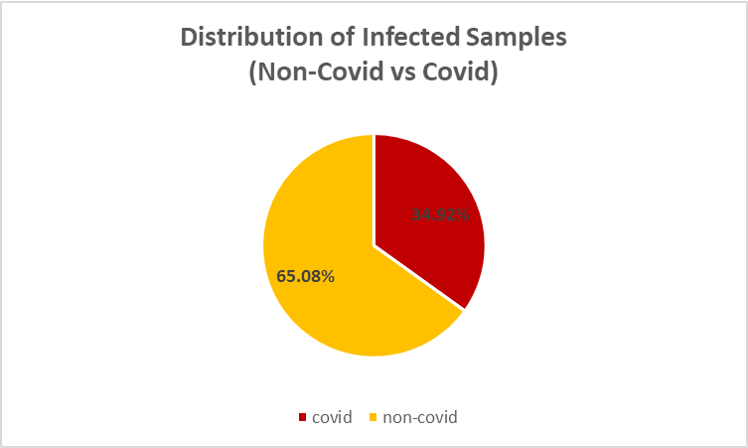|
|Fig. 1A|Fig. 1B|Fig. 1C|

1. **Overall Distribution**: Dataset is unbalanced with double the number infected-non-Covid samples (47.49%) than normal (25.47%) and infected-Covid samples (27.04%). 
2. **Distribution of Normal vs Infected**: Dataset contains 72.96% infected samples (includes Covid and non-Covid samples) with the remaining 27.04% as normal samples. 
3. **Distribution of Infected** (Covid vs Non-Covid): 65.08% of infected samples are non-Covid while 34.92% are Covid. 

From the 3 different distributions as described above, we see that the dataset is unbalanced, with a higher proportion of samples being infected-non-Covid samples. 

### 1.1.2 Train-Test-Validation Split
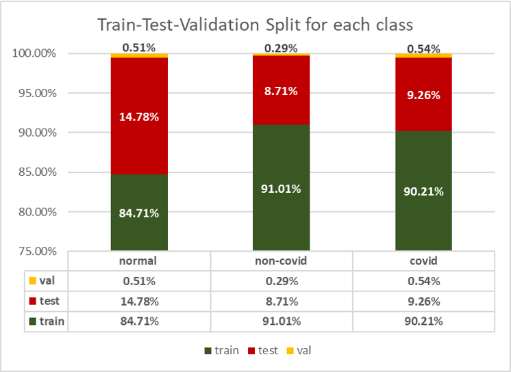

A higher proportion (14.78%) of normal samples are partitioned for training as opposed to infected covid and non-covid samples. 

### 1.2 Data Processing

1. **Normalisation.** Used to standardise input features to ensure better and faster convergence of the model. 

2. **Grayscale.** X-ray images are naturally quite monochrome to the human eye. However, the input images are saved "in colour" - that is, they contain 3 RGB channels. We decided to convert all inputs to grayscale, compressing input to a single channel. This can help make the model more generalisable (less detail) and also increase speed of computation. 

### 1.3 Data Augmentation
As discussed in Section 1.1, the dataset provided is not balanced. Data augmentation can help to generate new training samples  for the model to learn. In our model, we make use of ```Torchvision.Transforms.Compose``` to augment our training samples.  In every epoch, the transformations are randomly applied to the training dataset -- that is, the model sees a set of slightly varied input each epoch.  

1. **Photometric distortions.** A quick visual scan of the dataset reveals that training samples vary in terms of brightness and saturation.  Thus, we apply photometric distortions randomly to samples in their hue, saturation and brightness. This could help to better generalise the model. 
2. **Horizontal Flips.** X-rays of the chest are quite symmetrical, with the exception of the presence of a denser mass on the right-side of the radiograph (indicating the heart). Flipping samples horizontally provide a quick method of generating more training data within reasonable expectations. 
3. **Rotations.** We observed that some samples within the dataset exhibited a small amount of rotation. A small rotation of up to 10 degrees was thus randomly applied to training samples. Similarly to horizontal flips, this is a quick method of generation more training samples within reasonable expectations. 

The effect of data augmentation is positive -- our model obtains higher sensitivity when training with augmented data as compared to non-augmented data, while maintaining a similar level of accuracy. This evaluation is captured in the graph below. 

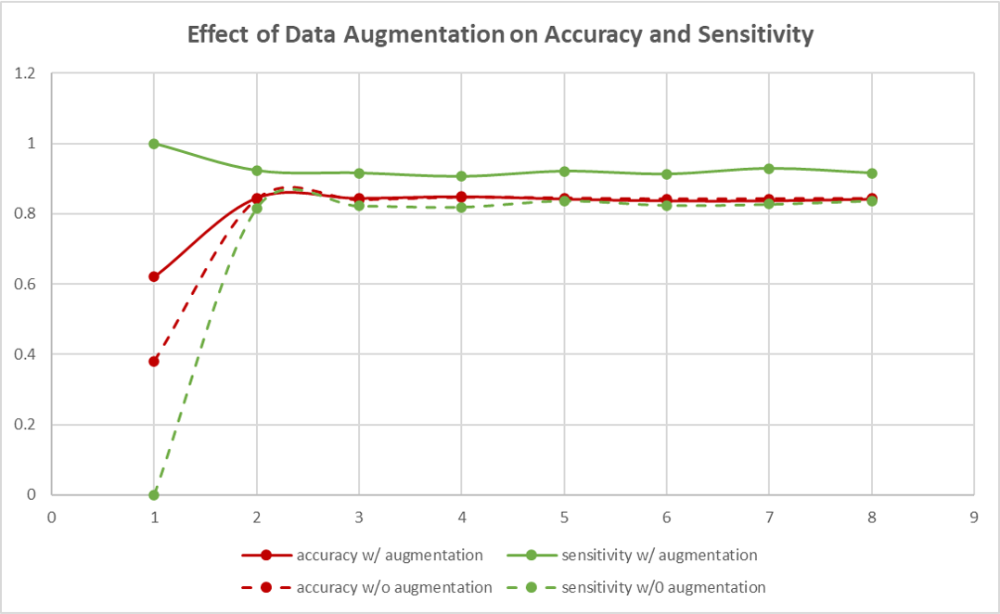


## 2. Classifier 
### 2.1 Choice of Architecture
#### 2.1.1 Difference in architecture
The 2-part binary architecture contains 2 sequential classifiers. The first classifier discriminates normal samples against infected samples whereas the second classifier only takes into account "infected" samples and discriminates against Covid and non-Covid samples within those found to be infected. 

In contrast, a single tri-class classifier completes the task in one step, distinguishing the 3 classes at the same time. 

#### 2.1.2 Hypothesis 
The team hypothesised that a 2-part binary architecture would be more suitable for the problem as classification task of (1) Normal vs Infected and; (2) Covid vs Non-Covid is quite different. The model probably considers different sets of structures for tasks (1) and (2). For example, the model might be concerned with finer details in the radiograph in task (2) while considering larger structures in task (1). 

To this end, we chose to work with a 2-part binary architecture.

#### 2.1.3 Architecture Evaluation
Experiments using both architectures were carried out and our hypothesis was confirmed. Results are shown in the table below. 

|Architecture|Train Set Accuracy|Test Set Accuracy|Validation Set Accuracy|
|:---:|:---:|:---:|:---:|
|2-part binary classifier|79.87%|79.19%|72.00%|
|tri-class classifier|81.58%|71.54%|60.00%|

Generally, the 2-part binary classifier gave better results. 

### 2.2 Model Design
The team primarily used convolutional layers in our model design, which is the most appropriate for an image-classification task. 

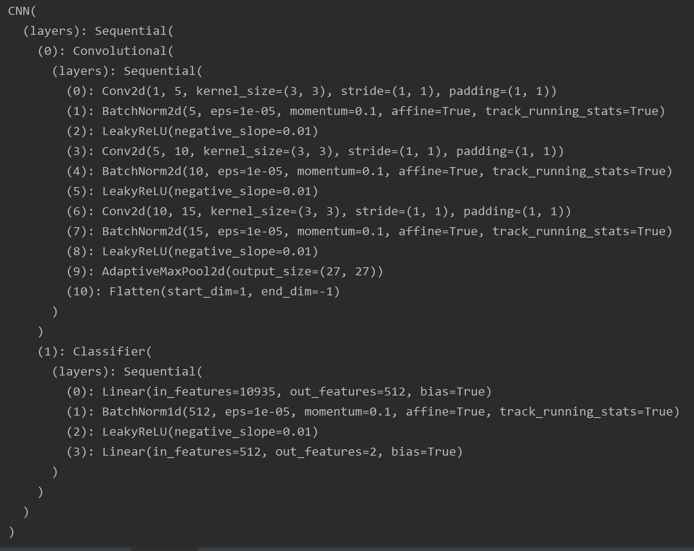

We experimented with a variety of model architectures by varying the number of convolutional layers (together with the number of channels) and fully connected layers. We also experimented with the inclusion of batchnorm and dropout layers, as well as residual and inception networks. The basic convolutional model showed the most promising performance with batch normalization, but without dropout layers.

Generally, we found that all of the models overfitted extremely quickly, which may be primarily attributed to the small size of the dataset. Every model routinely attained high training accuracy within a few epochs, but showed significantly poorer and highly varied performance on the test set. More complex models had accuracies ranging widely from 60% to 85%, often in consecutive epochs (despite there being little change in training set performance). Training a model beyond two to three epochs did not yield any significant improvement in overall test set accuracy (sometimes resulting in reduced performance as compared to earlier epochs). This phenomenon was observed even with strong regularization applied. A typical learning curve demonstrating this behaviour is shown in the figure below.

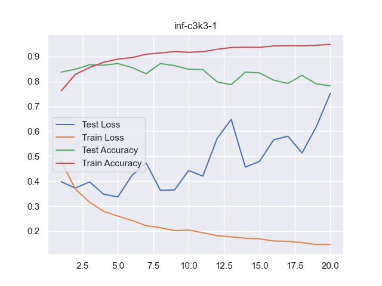

For this reason, we settled on a relatively basic convolutional model as a baseline model, with three convolutional layers and one fully connected hidden layer. Due to the small dataset, more complex architectures would only add overhead to the model without offering significant improvement in performance.

#### 2.2.1 Mini-batch size 
Theoretically, a smaller batch size might compute faster. However, as the model contains batchnorm layers, it is not ideal to have small batch sizes as  normalisation will not be stable. Based on conventions, a 32 or 64 batch size is normally used. We recorded the time taken for each batch size to complete 1 epoch:

|Batch size|Time Taken (s)|
|:---:|:---:|
|32|10.22|
|64|11.03|

Thus, we chose a batch size of 32 in the end. 

#### 2.2.2 Parameter Initialisation

Parameters were initialised randomly to avoid any potential model symmetry. It was also a good way to ensure some variance in training at each training epoch. 

#### 2.2.3 Loss function 

The **cross-entropy** loss function ```nn.CrossEntropyLoss```was used for this classification problem. As the dataset is biased, we used cross-entropy weights as calculated (same as calculation in *scikit-learn*: 
$$
w_0 = \frac{(n_0 + n_1)}{(2n_0)}
$$

where $n_0$ represents the number of samples in class 0. 

1. Infected vs Normal Classifier

|Infected|Normal|
|:---:|:---:|
|0.25|0.75|

2. Infected Covid vs Infected Non-Covid classifier 

|Covid|Non-Covid|
|:---:|:---:|
|0.65|0.35|

Regularisation was also done on the loss function by using the ```weight_decay``` parameter of the optimiser. The value of weight decay was decided using hyperparameter tuning, further described in Section 2.3.2 below.  

### 2.3 Choice of Optimiser
Initially, we used the Adam optimiser as it is the "default" choice in deep learning models. However, we realised that Adam did not generalise well and resulted in overfitting quite quickly.

From the pyTorch documentation and readings, we found that ```torch.optim.AdamW```  could alleviate overfitting by implementing a weight decay parameter that penalises the magnitude of weights (Graetz, 2020). This restricts the weights from becoming too large. 

Hyperparameters Learning Rate (LR) and Weight Decay (WD) of the AdamW optimiser was tuned separately for each classifier. This was done by changing the value of the hyperparameter while holding all other factors constant. The model was trained for 8 epochs and the last 4 values of each performance metric was averaged to obtain the final performance of the model for that hyperparameter value. 

We evaluated the hyperparameters using conventional performance measures such as accuracy, loss, sensitivity, specificity and f1-score. Specifically, we prioritise the performance accuracy and sensitivity. This is captured in the pink graph "acc_sens", which is an aggregate of the two measures, further described in Section 2.4.1. 


#### 2.3.1 Learning Rate (LR)
| |Normal VS Infected|Covid VS Non-Covid|
|:---:|:---:|:---:|
|Graph of Performance against Log(LR)|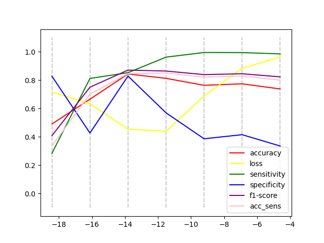|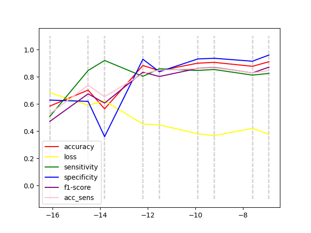|
|Optimal LR|2.3e-6|1e-5|

#### 2.3.2 Weight Decay (WD)
| |Normal VS Infected|Covid VS Non-Covid|
|:---:|:---:|:---:|
|Graph of Performance against Log(WD)|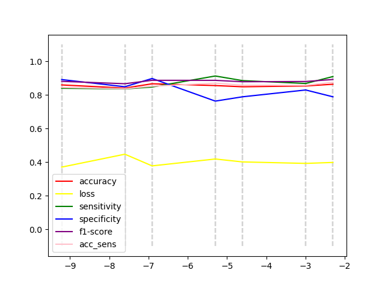||
|Optimal WD|5e-3|5e-3|

#### 2.3.3 Learning Rate Scheduler

We also tried to make use of a LR scheduler to improve performance. However, we realised that while the LR scheduler helped to push accuracy upwards, sensitivity suffered. 

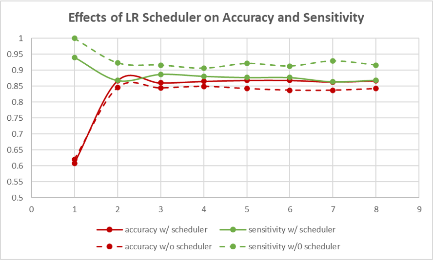

In the end, we chose the run the model without the learning rate scheduler to prioritise sensitivity over accuracy. A more detailed explanation of this choice is found in Section 2.4.1. 

### 2.4 Final Model Architecture

To combat the overfitting of the model and improve robustness, we settled on utilizing an ensemble method for our final model architecture. 

We constructed two ensemble models, one to predict on Covid/non-Covid and another on infected/normal, which was then assembled into a 2-part binary classifier.

We also constructed an additional standalone tri-class classification ensemble model, to evaluate our hypothesis that a 2-part binary classifier would outperform a standalone tri-class classifier.

Each ensemble consists of 10 distinct baseline models with the architecture described in 2.2. At prediction time, the input is run through all 10 models, and the majority output is treated as the prediction.

#### 2.4.1 Model Training and Selection

Each individual baseline model was trained on 75% of the training dataset for 20 epochs, to reduce the overfitting of each model on the training set.

As mentioned in 2.2, each model showed a high variance in test set accuracy between epochs. Besides tracking the model performance, we used the test set to produce model evaluation metrics such that we could select the model which is most generalizable. To this end, we saved the model that performed the best out of all 20 epochs, instead of naively saving the final model after 20 epochs, with the rationale that a model which generalizes well to the test set would also generalize well to all other data.

As this is a medical diagnosis, we factored in sensitivity as a model selection and evaluation metric, under the assumption that it is less costly to produce a false positive prediction than a false negative prediction (seeing as a false negative could potentially result in a pneumonia or Covid carrier spreading the disease to others). The final evaluation metric was thus designed to take into account both accuracy and sensitivity, with an additional balancing term to ensure  that neither metric is sacrificed too much.
$$
\text{performance} = \text{Acc.} + \text{Sens.} - 0.5 \times |\text{Acc.} - \text{Sens.}|
$$
The final training algorithm for an individual baseline model is as follows:

* For 20 epochs:
  * Perform mini-batch gradient descent using the training set.
  * Evaluate the model using the aforementioned performance metric.
    * If it is better than the currently best-performing model, save the model and note it as the new best-performing model.

For each type of classifier, we also selected for the optimal kernel size of the convolutional layers (between 3, 5, and 7).

| Kernel Size | Classifier                | Test Accuracy | Test Sensitivity |
| ----------- | ------------------------- | ------------- | ---------------- |
| 3           | Infected/Non-infected     | 81.95%        | 97.38%           |
| **5**       | **Infected/Non-infected** | **82.76%**    | **97.38%**       |
| 7           | Infected/Non-infected     | 82.60%        | 98.16%           |
| 3           | Covid/Non-covid           | 92.39%        | 89.93%           |
| **5**       | **Covid/Non-covid**       | **90.55%**    | **92.09%**       |
| 7           | Covid/Non-covid           | 86.88%        | 93.53%           |

Based on these results, we chose the models with the kernel size of 5 for the final ensemble assembly.


## 3. Results 
### 3.1 Validation Set Performance

The diagram below shows the performance of the 2-part binary classifier on the validation set. As we incorporated sensitivity into the model selection, it was able to achieve 100% sensitivity with the tradeoff of a relatively lower accuracy. All misclassifications came from either a normal case being classified as infected, or a infected non-Covid case being classified as a Covid case.

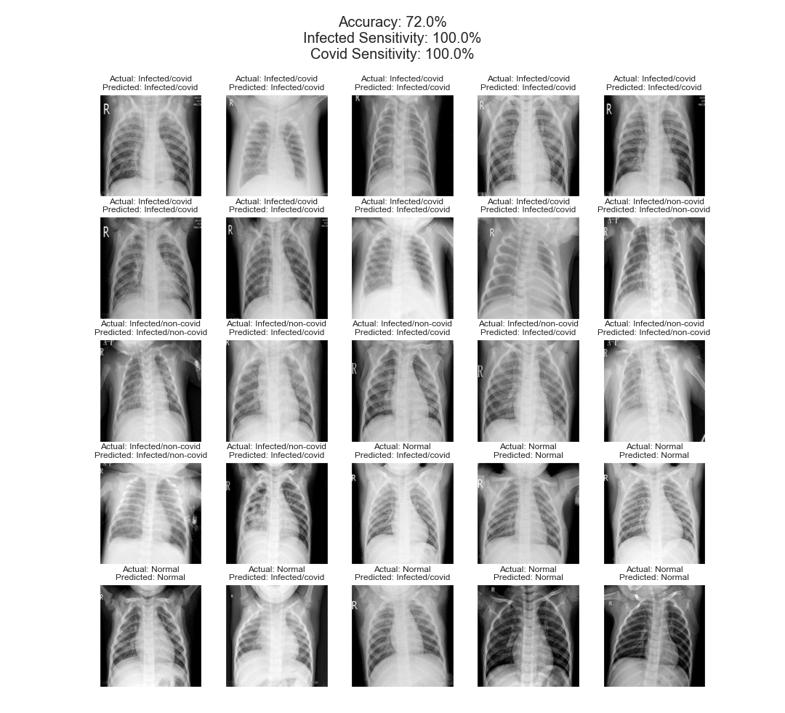

The diagram below shows the performance of the tri-class classifier on the validation set. Like the 2-part binary classifier, it exhibits a cautious characteristic and attains 100% sensitivity, but has a lower accuracy, as predicted in 2.1.2.


### 3.2 Evaluation of Results 

#### 3.2.1 Relative Difficulties of Binary Classification

We hypothesized that the infected/non-infected classification problem would be easier than the Covid/non-Covid classification problem, with the assumption that the difference between an infected and non-infected x-ray would be more significant than the difference between a Covid and infected non-Covid x-ray, which might require looking into finer details of the image.

With reference to the table in 2.4.1, the infected/non-infected classifier exhibited a lower accuracy of 82% compared to the Covid/non-Covid classifier, which had an accuracy of 90%. This appears to contradict the hypothesis. However, the infected/non-infected classifier also has a higher sensitivity of 97%, compared to 92% for the Covid/non-Covid classifier.

This may also be attributed to the relative imbalances in the dataset. While 73% of the dataset has the infected label, only 35% of the infected samples are Covid cases. It may thus be more challenging for a model to identify positive Covid cases correctly as compared to positive infected cases, since the dataset consists of a relatively smaller proportion of positive labels.

#### 3.2.2 Typical examples of failures

| Example                                    | Observations                                                 |
| ------------------------------------------ | ------------------------------------------------------------ |
|    | The diagram shows a typical example of when the model predicts a "normal" sample as "infected/Covid". This occurs when the radiograph is murkier overall, as compared the the correctly predicted sample. We also observe a higher "level" of white mass from the bottom on the wrongly predicted sample. |
|  | The diagram shows a typical example of when the model predicts an "infected/non-Covid" sample as "infected/Covid". We observe that the incorrectly labelled radiograph is clearer at the lungs area than the correctly predicted sample. We also observe a lower "level" of white mass from the bottom on the wrongly predicted sample. |


### 3.3 Feature Maps 

Feature maps of both infected and Covid classifiers are generated as below. Although it is not obvious to us what the model is trying to pick up at each filter (as we are neither the machine nor the doctor), we can still observe that different features / structures of the image is being highlighted at each stage. An obvious structure that the filters detect is the ribcages. 

|            Infected/Normal            |            Covid/Non-Covid            |
| :-----------------------------------: | :-----------------------------------: |
| 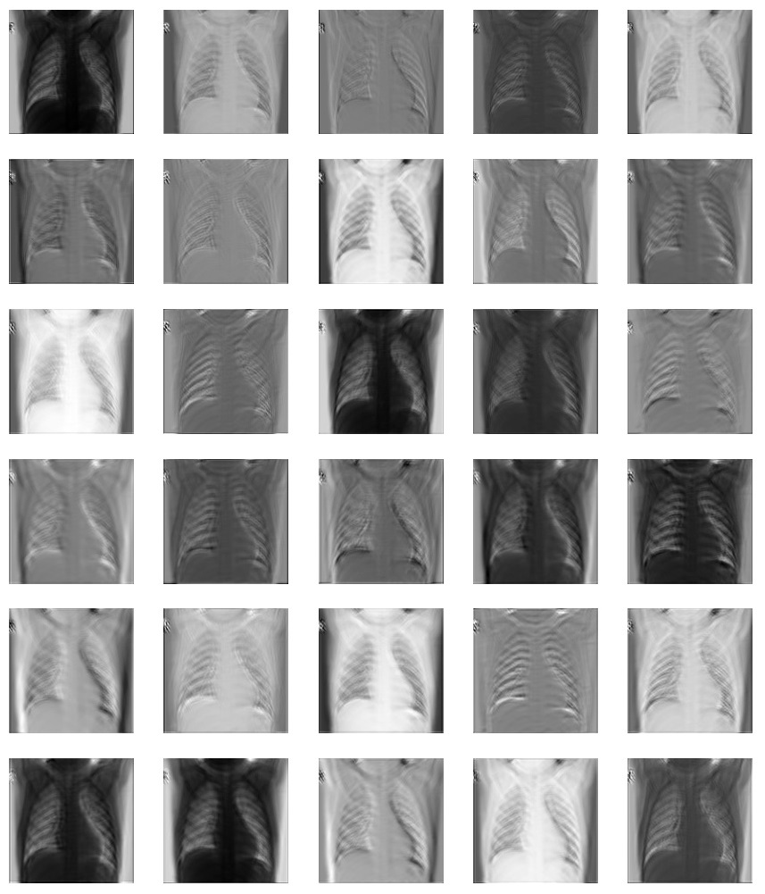 | 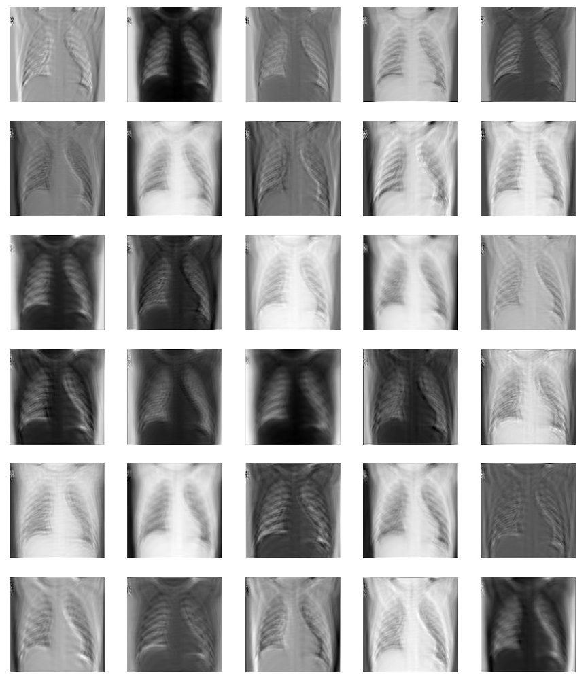 |

### 3.4 Relation to the Real-World 

From some research, (please note that none of the medical explanation described here are professional and are solely gleaned from searches off the internet!), we find the concept of applying deep learning in classifying radiographs is quite similar to how doctors do it. Specifically, doctors diagnose from radiographs primarily from its **silhouette sign** (Voigt, 2008) -- they are concerned about loss of clarity in structures on the radiograph, and the position of the problem area might suggest different causes. CNNs are similar here in trying to detect structures that stand out from the *established norm*. The difference here is that the CNN needs to establish its own standards by way of supervised learning, while doctors already have a medical standard to adhere to, even if each patient's situation differs. 

The classification process of doctors and CNNs are also similar, where they both learn from experience and iterations of the same task. Doctors get feedback from their clinicians and patients while CNNs get feedback in the form of loss, accuracy, and other performance metrics. 

A large difference in diagnosis stems from how the x-ray image is used. For doctors, it is a *tool* that can help them to confirm or disprove a diagnosis. Most of the time, doctors have other contextual evidence (i.e. symptoms of sickness) to help them. For our model, the CNN relies solely on the image for classification. 

# References 

[1] Graetz, F. (2020, February 12). Why adamw matters. Retrieved March 20, 2021, from https://towardsdatascience.com/why-adamw-matters-736223f31b5d

[2] Hasan, F. (2020, September 23). Deep learning with weighted cross entropy loss on imbalanced tabular data using fastai. Retrieved March 20, 2021, from https://towardsdatascience.com/deep-learning-with-weighted-cross-entropy-loss-on-imbalanced-tabular-data-using-fastai-fe1c009e184c

[3] Voigt, S. (2008, May). How to read a chest x-ray – a step by step approach. Retrieved March 20, 2021, from http://www.southsudanmedicaljournal.com/archive/2008-05/how-to-read-a-chest-x-ray-a-step-by-step-approach.html

