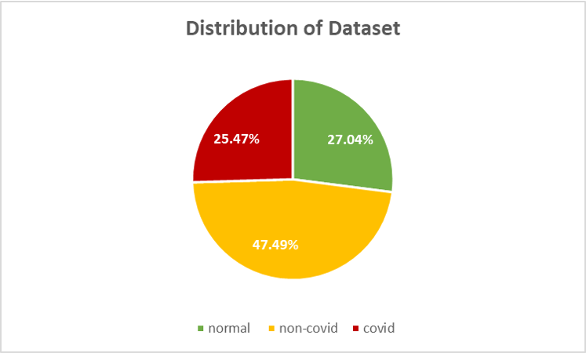
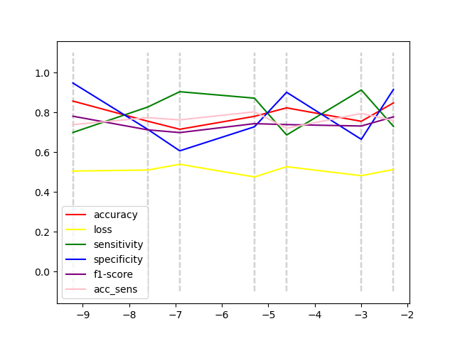

# Deep Learning Small Project 
By: Chan Luo Qi (1002983), Seow Xu Liang (1003324)

## 1. Dataset 
### 1.1 Dataset Exploration 

#### 1.1.1 Data distribution 
- [x] distribution of images 
- [x] discussion of whether dataset is balanced / uniformly distributed etc - not sure if enough
- [x] graphs 
- [x] discuss typical data processing operations applied, why? 
- [ ] (Bonus) Data Augmentation techniques, why and proof of how it benefited the model 


| | Normal | Infected (Non-Covid) | Infected (Covid)|Total|
|:---:|:---:|:---:|:---:|:---:|
|Train|1341|2530|1345|5216|
|Test|234|242|138|614|
|Validation|8|8|8|24|
|Total|1583|2780|1491|5854|

|Overall distribution|Normal vs Infected|Infected Distribution|
|:---:|:---:|:---:|
||||
|Fig. 1A|Fig. 1B|Fig. 1C|

1. **Overall Distribution**: Dataset is unbalanced with double the number infected-non-Covid samples (47.49%) than normal (25.47%) and infected-covid samples (27.04%). 
2. **Distribution of Normal vs Infected**: Dataset contains 72.96% infected samples (includes Covid and non-Covid samples) with the remaining 27.04% as normal samples. 
3. **Distribution of Infected** (Covid vs Non-Covid): 65.08% of infected samples are Covid while 34.92% are non-Covid. 

From the 3 different distributions as described above, we see that the dataset is unbalanced, with a higher proportion of samples being infected-Covid samples. 

### 1.1.2 Train-Test-Validation Split


### 1.2 Data Processing
1. **Normalisation.** Used to standardise input features to ensure better and faster convergence of the model. 

2. **Grayscale.** X-ray images are naturally quite monochrome to the human eye. However, the input images are saved "in colour" - that is, they contain 3 RGB channels. We decided to convert all inputs to grayscale, compressing input to a single channel. This can help make the model more generalisable (less detail) and also increase speed of computation. 

### 1.3 Data Augmentation
As discussed in Section 1.1, the dataset provided is not balanced. Data augmentation can help to generate new training samples  for the model to learn. In our model, we make use of ```Torchvision.Transforms.Compose``` to augment our training samples.  In every epoch, the transformations are randomly applied to the training dataset - that is, the model sees a set of slightly varied input each epoch.  

1. **Photometric distortions.** A quick visual scan of the dataset reveals that training samples vary in terms of brightness and saturation.  Thus, we apply photometric distortions randomly to samples in their hue, saturation and brightness. This could help to better generalise the model. 

2. **Horizontal Flips.** X-rays of the chest are quite symmetrical, with the exception of the presence of a denser mass on the right-side of the radiograph (indicating the heart). Flipping samples horizontally provide a quick method of generating more training data within reasonable expectations. 

3. **Rotations.** A small rotation of 10 degrees was randomly applied to training samples. Similar to horizontal flips, this is a quick method of generation more training samples within reasonable expectations. 


## 2. Classifier 
- [x] Discuss difference between the two architectures above and defend which one we chose and why 
- [ ] Discuss reasons behind this choice of model structure (types of layers, # of params)
- [x] Discuss value for mini-batch size 
- [x] Explain choice of loss function and its parameters (if any)
- [x] (Bonus) Implementing regularisation on loss function and discuss its appropriate choice of parameters and benefits for model 

- [x] Explain choice of optimiser and its parameters
- [ ] (Bonus) Implementing scheduler and discuss its appropriate choice of parameters and benefits 
- [ ] Explain choice of initialisation of model parameters
- [ ] Learning curves to show evolution of loss function and other performance metrics over epochs for both train and test sets

### 2.1 Choice of Architecture
#### 2.1.1 Difference in architecture
The 2-part binary architecture contains 2 sequential classifiers. The first classifier discriminates normal samples against infected samples whereas the second classifier only takes into account "infected" samples and discriminates against covid and non-covid samples within those found to be infected. 

In contrast, a single tri-class classifier completes the task in one step, distinguishing the 3 classes at the same time. 

#### 2.1.2 Hypothesis 
The team hypothesised that a 2-part binary architecture would be more suitable for the problem. We theorised that classification task of (1) Normal vs Infected and; (2) Covid vs Non-Covid is quite different. The model will probably have to consider different sets of structures for task (1) and (2). For example, the model might be concerned with finer details in the radiograph in task (2) while considering larger structures for task (1). 

To this end, we chose to work with a 2-part binary architecture.

#### 2.1.3 Architecture Evaluation
Experiments using both architectures were carried out and our hypothesis was confirmed. Results are shown in the table below. 

|Architecture|Training Accuracy|Test Accuracy|
|:---:|:---:|:---:|
|2-part binary classifier|xx|xx|
|tri-class classifier|xx|xx|

Generally, the 2-part binary classifier gave better results. However, its improvement over the tri-class classifier was less than expected and could be attributed to the unbalanced dataset. 

### 2.2 Model Design
The team primarily used convolutional layers in our model design, which is the most appropriate for an image-classification task. 


#### 2.2.1 Number of Layers 
#### 2.2.2 Number of features

#### 2.2.3 Mini-batch size 
Theoretically, a smaller batch size might compute faster. However, as the model contains batchnorm layers, it is not ideal to have small batch sizes as the normalisation will not be stable. Based on conventions, a 32 or 4 batch size is normally used. We recorded the time taken for each batch size to complete 1 epoch:

|Batch size|Time Taken (s)|
|:---:|:---:|
|32|10.22|
|64|11.03|

Thus, we chose a batch size of 32 in the end. 

#### 2.2.4 Loss function 
The **cross-entropy** loss function ```nn.CrossEntropyLoss```was used as this is a classification problem. As the dataset is biased, we used cross-entropy weights as calculated: $ w_0 = (n_0 + n_1)/(2*n_0) $, where $n_0 = $ # of samples with label 0, and $w_0 =$ weight for class 0. 

|infected|normal|
|:---:|:---:|
|0.25|0.75|

|covid|non-covid|
|:---:|:---:|
|0.65|0.35|

Regularisation was also done on the loss function by using the ```weight_decay``` parameter of the optimiser. The value of weight decay was decided using hyperparameter tuning, further described in Section XX below.  

### 2.3 Choice of Optimiser
Initially, we used the Adam optimiser as it is the "default" choice in deep learning models. However, we realised that Adam did not generalise over the data well and resulted in overfitting quite quickly.

Reading pyTorch's documentation, we found that ```torch.optim.AdamW``` could alleviate overfitting by implementing a weight decay parameter that penalises the magnitude of weights. 

[need to show graph to prove less overfitting????]

Hyperparameters Learning Rate (LR) and Weight Decay (WD) of the AdamW optimiser was tuned separately for each classifier. This was done by changing the value of the hyperparameter while holding all other factors constant. The model was trained for 8 epochs and the last 4 values of each performance metric was averaged to obtain the final performance of the model for that hyperparameter value. 

#### 2.3.1 Learning Rate (LR)
| |Normal VS Infected|Covid VS Non-Covid|
|:---:|:---:|:---:|
|Graph of Performance against Log(LR)|||
|Optimal LR|2.3e-6|1e-5|

#### 2.3.2 Weight Decay (WD)
| |Normal VS Infected|Covid VS Non-Covid|
|:---:|:---:|:---:|
|Graph of Performance against Log(WD)|||
|Optimal WD|5e-3|5e-3|

### 2.4 Final Model / Architecture (?)  
describe the ensemble method here?


## 3. Results 
- [ ] Subplot on the validation set with ground truth, predicted labels + all performance metrics used 
- [ ] Discuss if we expected that COVID_NON-COVID was harder than INFECTED_NOT-INFECTED, why? 
- [ ] Would it be better to have high overall accuracy or low true negatives / false positive rates? Why?
- [ ] Does the model seem to replicate how doctors diagnose infections based on x-rays? 
- [ ] (Bonus) Show typical samples of failures and discuss what might be the reason? 
- [ ] Feature maps


